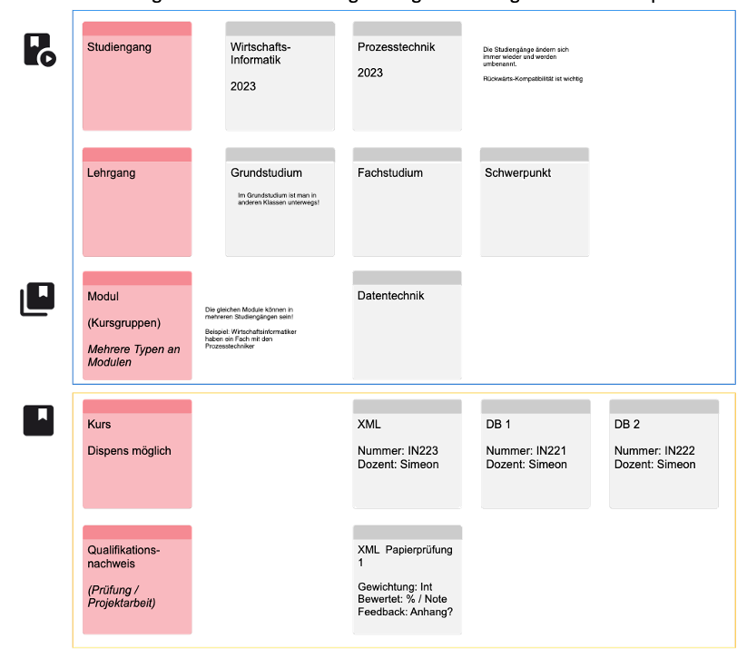

# Architecture constraints
This chapter helps identify where developers have flexibility in their design decisions and where they must comply with established constraints. 

These constraints sometimes go beyond individual systems and are valid for whole organizations and companies. It is essential to address these constraints directly, as they guide the development process and ensure adherence to organizational standards and technical requirements.

## Technical Constraints

| Constraint | Description |
|------------|-------------|
| Development Environment | SmashGrade should interact with the hftm infrastructure. This includes Azure AD, hftm GitHub, hftm Webserver, webUntis (schedules), moodle (course materials and attendance), MS 365 (Teams, Office Apps), and Switch. |
|Tech-Stack| The choice of technology stack for the development of SmashGrade is not limited by prior organizational preferences or existing expertise. The project team is encouraged to select the most appropriate technologies based on the specific needs, performance criteria, and the overall project goals. The decision should prioritize adaptability, scalability, and the potential for innovation, ensuring the best fit for the application's requirements. |

## Organizational Constraints

| Constraint | Description | Relevant Articles |
|------------|-------------|-------------------|
| Study Regulations | The hftm specifies clear regulations in the School and Examination Regulations. |
| Study Types | SmashGrade must be developed for both full-time (2 years) and part-time studies (3 years excluding thesis). |
| Study Programs | Tje study programs are defined and advertised by hftm. These are subject to change and not always offered every year. They consist of a major with an optional focus. |
| Course Requirements | Courses require proof of qualification for a module to be considered passed. |
| Grade Evaluation | Grades range from 1 to 6, with percentage values from 0 to 100%. |
| Naming Conventions | A common "wording" is established in the School and Examination Regulations. This naming convention must be adapted within the app. |
| Course Structure | Each module contains 2 to n courses, with several evaluations (0 to n). A module must have a minimum overall grade of 4.0; otherwise, according to the study regulations, the student's studies are halted, and they must repeat the failing courses. |
| Corporate Design / Brand Identity | The corporate design of hftm is documented in the hftm_ci_cd_manual. |
| Proof of Qualification Types | Possible types include oral or written exams, presentations, learning reports, written assignments, learning journals, and attendance records for courses with mandatory attendance (out-of-scope for this application). |
| Course Module Evaluation | Modules are evaluated based on a set of criteria: F, M, D, E | Art. 29-32 |
| Student Dispensation | Students can be exempted from courses, allowing them to hide these courses independently. (out of scope) | Art. 19 §6 |

### Naming Convention 
The full glossary is documented in chapter 12. This image acts as visual representation to showcase the implicit hirarchy of the elements. 

### Course Module Evaluation

| Modultyp | Beschreibung                                                                                   | Artikel |
|----------|------------------------------------------------------------------------------------------------|---------|
| F        | Modul bestanden, wenn jeder Kurs eine genügende Bewertung aufweist.                            | Art. 29 |
| M        | Modul bestanden, wenn der Durchschnitt aller Kurse genügend und nicht mehr als ein Kurs im Modul ungenügend ist. | Art. 30 |
| D        | Modul bestanden, wenn der Durchschnitt der Kurse genügend ist (mehr als 60%).                 | Art. 31 |
| E        | Modul bestanden, wenn alle Kurse erfüllt sind.                                                 | Art. 32 |
